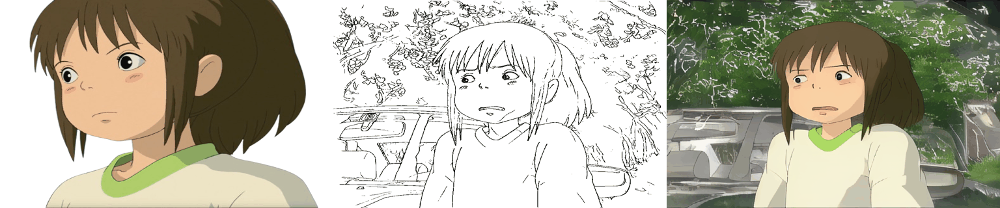

# AniDoc: Animation Creation Made Easier
<a href="https://yihao-meng.github.io/AniDoc_demo/"></a>
<a href="https://arxiv.org/pdf/2412.14173"></a>


https://github.com/user-attachments/assets/99e1e52a-f0e1-49f5-b81f-e787857901e4


> <a href="https://yihao-meng.github.io/AniDoc_demo">**AniDoc: Animation Creation Made Easier**</a>
>

[Yihao Meng](https://yihao-meng.github.io/)<sup>1,2</sup>, [Hao Ouyang](https://ken-ouyang.github.io/)<sup>2</sup>, [Hanlin Wang](https://openreview.net/profile?id=~Hanlin_Wang2)<sup>3,2</sup>, [Qiuyu Wang](https://github.com/qiuyu96)<sup>2</sup>, [Wen Wang](https://github.com/encounter1997)<sup>4,2</sup>, [Ka Leong Cheng](https://felixcheng97.github.io/)<sup>1,2</sup>, , [Zhiheng Liu](https://johanan528.github.io/)<sup>5</sup>, [Yujun Shen](https://shenyujun.github.io/)<sup>2</sup>, [Huamin Qu](http://www.huamin.org/index.htm/)<sup>†,2</sup><br>
<sup>1</sup>HKUST <sup>2</sup>Ant Group <sup>3</sup>NJU <sup>4</sup>ZJU <sup>5</sup>HKU <sup>†</sup>corresponding author

> AniDoc colorizes a sequence of sketches based on a character design reference with high fidelity, even when the sketches significantly differ in pose and scale.  
</p>

**Strongly recommend seeing our [demo page](https://yihao-meng.github.io/AniDoc_demo).**


## Showcases:
<p style="text-align: center;">
  
</p>
<p style="text-align: center;">
  
</p>
<p style="text-align: center;">
  
</p>
<p style="text-align: center;">
  
</p>

## Flexible Usage:
### Same Reference with Varying Sketches
<div style="display: flex; flex-direction: column; align-items: center; gap: 20px;">


 
<div style="text-align:center; margin-top: -50px; margin-bottom: 70px;font-size: 18px; letter-spacing: 0.2px;">
        <em>Satoru Gojo from Jujutsu Kaisen</em>
</div>
</div>

### Same Sketch with Different References.

<div style="display: flex; flex-direction: column; align-items: center; gap: 20px;">


 
<div style="text-align:center; margin-top: -50px; margin-bottom: 70px;font-size: 18px; letter-spacing: 0.2px;">
        <em>Anya Forger from Spy x Family</em>
</div>
</div>

## TODO List

- [x] Release the paper and demo page. Visit [https://yihao-meng.github.io/AniDoc_demo/](https://yihao-meng.github.io/AniDoc_demo/) 
- [x] Release the inference code.
- [ ] Build Gradio Demo
- [ ] Release the training code.
- [ ] Release the sparse sketch setting interpolation code.


## Requirements:
The training is conducted on 8 A100 GPUs(80GB VRAM), the inference is tested on RTX 5000(32GB VRAM). In our test, the inference requires about 14GB VRAM.
## Setup
```
git clone https://github.com/yihao-meng/AniDoc.git
cd AniDoc
```

## Environment
All the tests are conducted in Linux. We suggest running our code in Linux. To set up our environment in Linux, please run:
```
conda create -n anidoc python=3.8 -y
conda activate anidoc

bash install.sh
```
## Checkpoints
1. please download the pretrained stable video diffusion(SVD) checkpoints from [here](https://huggingface.co/stabilityai/stable-video-diffusion-img2vid/tree/main), and put the whole folder under `pretrained_weight`, it should look like `./pretrained_weights/stable-video-diffusion-img2vid-xt`
2. please download the the checkpoint for our Unet and ControlNet from [here](https://huggingface.co/Yhmeng1106/anidoc/tree/main), and put the whole folder as `./pretrained_weights/anidoc`. (The checkpoint will be released in one day)
3. please download the co_tracker checkpoint from [here](https://huggingface.co/facebook/cotracker/blob/main/cotracker2.pth) and put it as  `./pretrained_weights/cotracker2.pth`.
   


## Generate Your Animation!
To colorize target lineart sequence with a specific character design, you can run the following command:
```
bash  scripts_infer/anidoc_inference.sh
```


We provide some test cases in  `data_test` folder. You can also try our model with your own data. You can change the lineart sequence and corresponding character design in the script `anidoc_inference.sh` , where `--control_image` refers to the lineart sequence and `--ref_image` refers to the character design. 


## Citation:
Don't forget to cite this source if it proves useful in your research!
```bibtex
@article{meng2024anidoc,
      title={AniDoc: Animation Creation Made Easier},
      author={Yihao Meng and Hao Ouyang and Hanlin Wang and Qiuyu Wang and Wen Wang and Ka Leong Cheng and Zhiheng Liu and Yujun Shen and Huamin Qu},
      journal={arXiv preprint arXiv:2412.14173},
      year={2024}
}

```
